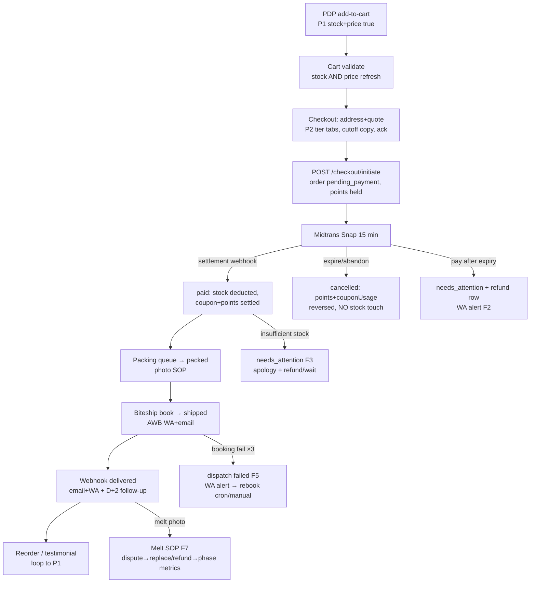

# P5 — EXCEPTIONS → DISPUTES → RETENTION LOOP

> Layer owner: PROCESS. Scope: everything off the happy path (payment, stock, address, dispatch, delay, melt, wrong item, WA silence) + refund integrity + post-delivery trust + repurchase. Includes the E2E global synthesis (final section).
> Ground truth: `app/api/admin/disputes/route.ts`, `app/api/admin/disputes/[id]`, `app/api/admin/orders/[id]/refund/route.ts`, `lib/db/schema.ts` (disputes/refunds/webhook_events), `lib/shipping/phase-gate.ts` (spoilage feedback loop), `lib/constants/financial-rules.ts`, crons `expire-points`, `points-expiry-warning`, `reconcile-points`. Date: 2026-07-19.
> Depends on: P1–P4, L1 (dispute playbook), L2 (refund reserve, Rule 7), L5 (retention). Feeds: P1 (the loop).
> Non-goals: marketing campaigns (L5), new feature surface.

## Executive summary

- The dispute→refund ledger skeleton is real and better than most launch-stage shops: disputes carry category/status/refundId (`schema.ts:731-746`), spoilage disputes **feed the phase gate metrics** (`phase-gate.ts:72-84`) — the system literally won't expand frozen delivery while melt claims are high. Protect this loop; it is the brand's immune system.
- **Refund completion is a status change with no consequences:** `PATCH /api/admin/orders/[id]/refund` updates the refunds row only (`refund/route.ts:46-58`) — order stays `paid`/`delivered` (the `refunded` enum state is unreachable in code), earned points are never clawed back, coupons stay consumed, and nothing checks the L2 refund reserve. A refunded customer keeps loyalty points minted on money that was returned — a direct L2 Rule 3 violation ("loyalty never paid on money not received").
- Dispute intake is **admin-only by design** (superadmin/owner roles, `disputes/route.ts:28-29`) — correct for solo ops (WA is the customer channel), but the SOP that converts a WA melt-photo into a dispute row within minutes exists nowhere in writing. The playbook is in L1; the *ritual* (who types what where, in what order) is defined here.
- **Net-30 B2B is live in code while L2 says it must not be:** `initiate/route.ts:391-404` marks any `b2bProfiles.isNet30Approved` order `paid` with zero cash, while `B2B_CREDIT_ENABLED_DEFAULT = false` (`financial-rules.ts:36`) declares "no Net-30 for first 90 days". One admin toggle away from unsecured credit at launch — a governance gap, not a code bug.
- Retention plumbing exists (points expiry crons, `points-expiry-warning` at 09:00, testimonials API) but the **first-order → review → reorder** loop has no trigger: delivered orders get one delivered email/WA and then silence. One templated WA at D+2 ("gimana dimsum-nya? 🥟") is the cheapest retention asset a solo operator owns — and doubles as melt-detection radar before a public complaint.

## Core question

When anything breaks after money moved, can one human close the exception inside its SLA — with the ledger (stock, points, coupon, refund reserve) ending consistent and the customer either retained or cleanly refunded without brand damage?

## Failure taxonomy (the master list)

| # | Class | Detected by (after P3/P4 fixes) | Owner path |
|---|-------|-------------------------------|-----------|
| F1 | Payment expire / retry exhaustion | cron + retry cap (auto-cancel, clean reversal) | auto |
| F2 | Expire-then-pay | `needs_attention` + WA (P3 #5) | refund SOP |
| F3 | Oversell at settlement | `needs_attention` + WA (P3 #5) | apology + refund/wait choice |
| F4 | Bad/incomplete address | blocked at initiate (P2 #2); residue → courier WA | edit + re-book |
| F5 | Dispatch fail / courier no-show | WA alert ✅ + retry cron (P4 #1) + SLA clocks | rebook ≤2h or proactive WA |
| F6 | Delay past promised day | SLA clock `shipped>6h` (P4 #5) | proactive WA before customer asks |
| F7 | Melt / spoilage on arrival | customer WA photo | **Melt SOP** below — the brand-defining path |
| F8 | Wrong item / short pack | customer WA | replace next dispatch or partial refund |
| F9 | Lost package | Biteship tracking stalls | courier claim + customer refund first (don't make her wait for the courier) |
| F10 | Pickup no-show >48h | flag (P4 #7) | FD#7 policy |
| F11 | WA silence (Bashara unreachable) | none — human single-point-of-failure | maintenance-mode + auto-reply SOP below |

## Happy-path (exception) swimlane — the Melt SOP (F7, "ganti atau refund" operationalized)

| # | Actor | System | State change | Customer-visible | Clock |
|---|-------|--------|--------------|-----------------|-------|
| 1 | Customer | WA photo of melted pack | none | — | T0 |
| 2 | Bashara | replies with L1 apology template, no liability debate: "Maaf banget, Bu. Ganti baru atau refund penuh — pilih yang mana?" | none | choice offered | ≤15 min (business hours) |
| 3 | Bashara | `POST /api/admin/disputes` {category: spoilage, refundAmount if refund chosen} | dispute `open`, refund row `pending` (reason auto-mapped `cold_chain_failure` ✅ `disputes/route.ts:49`) | — | ≤30 min |
| 4a | Bashara (replace) | creates manual replacement order (Rp 0 admin order — SOP: mark customerNote "REPLACEMENT {orig no}") | stock deducted via admin flow | new AWB WA'd | next dispatch slot |
| 4b | Bashara (refund) | Midtrans dashboard refund → `PATCH .../refund` status=completed + midtransRefundId | refund row completed; **plus new: order → refunded, points clawback** (backlog #1) | "dana kembali 1-7 hari kerja" | ≤48h, hard limit 7d (L2 `REFUND_DUE_DAYS`) |
| 5 | Bashara | dispute → resolved with ownerNotes (root cause: ice pack? courier delay? distance?) | phase metrics update automatically | — | same day |
| 6 | System | spoilage rate recomputed on next frozen checkout (`computePhaseMetrics`) | may force phase0 | honest scope | automatic |

## Depth analysis table

| Depth | Current state | Break mode | Customer impact | Solo-ops impact | Recommendation |
|-------|---------------|-----------|-----------------|-----------------|----------------|
| D1 Surface | No customer-facing dispute status; everything via WA | customer re-asks daily | anxiety | repeated WAs | Accept for launch (WA *is* the status page); log every promise made in dispute ownerNotes |
| D2 Operational | Dispute create + resolve routes exist; no SLA timestamps beyond resolvedAt | breach invisible | slow resolution | none | Ops card: `disputes open >24h` count (one query) |
| D3 Financial / Inventory | Refund completion mutates nothing but the refund row; reserve (5% weekly gross) never computed anywhere | points kept on refunded money; reserve fiction | double-dipping possible | ledger drift | Backlog #1: refund side-effects; ops card shows `pending refunds total vs 5% weekly gross` |
| D4 Strategic | Spoilage→phase-gate loop ✅; hiring trigger (80/wk) + solo ceiling (60/wk) constants exist unused | scale past capacity silently | quality collapse | burnout | Weekly ritual computes orders/week vs 60/80 — one SQL, one L4 card line |
| D5 Existential brand risk | One unhandled melt + one "refund belum masuk" week = heritage brand damage | — | — | — | The Melt SOP ≤15-min first response is THE brand policy; publish the promise on `/trust` and honor it |

## State machine

Dispute: `open → in_progress → resolved | rejected` (enum ✅). Illegal: reopen after resolved (create new dispute, link in notes).
Refund: `pending → processing → completed | failed` (enum ✅). New invariants (backlog #1): `completed` ⇒ order.status `refunded` (full) with points clawback + stock decision; `failed` ⇒ `needs_attention`.
Illegal today but reachable: refund `completed` while order still earns/holds points — must become impossible.

## Failure matrix (exception-handling failures — meta-failures)

| Failure | Detection | Auto-recovery | Human SOP | Customer message | Money effect | Max time-to-ack |
|---|---|---|---|---|---|---|
| Refund promised, never executed | refundsOverdue query (fixed, P4 #2) + `refundDueDate` | none | daily card row | proactive "dana diproses, ini buktinya" | trust + legal | 24 h |
| Points not clawed back on refund | reconcile-points cron (verify it checks this — **ASSUMPTION**, else backlog #1 covers) | backlog #1 | — | none | loyalty leak ≤1%/order | weekly |
| Dispute forgotten open | `open >24h` card row | none | morning ritual | — | — | 24 h |
| Replacement order melts again | second spoilage dispute same address | none | refund + geo note: flag area in L3 map | honest "area Anda belum aman untuk frozen" | refund | immediate |
| Bashara sick / offline (F11) | none | none | **Maintenance SOP:** system_settings soft-launch banner text → "Libur sebentar, pesanan diproses {date}"; disable frozen tiers via `shipping_phase=phase0`; WA auto-reply; pause ads | banner + auto-reply | paused revenue > broken promises | before going dark |
| Chargeback via Midtrans | Midtrans dashboard email | none | respond with order snapshot + packing photo + POD | — | held funds | 48 h |

## Stakeholder rotation

- **Ibu RT:** a melt handled in 15 minutes converts her into the brand's loudest advocate; the refund itself matters less than the speed of "ganti atau refund?". Never ask her to photograph more than once.
- **Warehouse:** every dispute resolution must write the root cause into ownerNotes — his packing ritual only improves if F7s are attributed (ice pack count? courier wait time? Friday heat?).
- **Bashara:** exception work is unbounded; the taxonomy above is his triage card. Anything not in F1–F11 gets a new row, not improvisation.
- **Brand owner:** refunds are marketing spend at 100% conversion to goodwill. **Conflict:** L2 wants reserve discipline (5%); brand wants instant generous refunds. Resolution: instant decision ≤ Rp 200k without deliberation; above that, sleep on it one night, never two.

## Major decisions (max 3)

### Decision 1 — Refund side-effects (order status, points, stock)
A: `refund completed` (full) ⇒ order → `refunded`, claw back `pointsEarned` (GREATEST floor 0, history row "Penyesuaian refund {no}"), stock restored only if goods never left/returned sellable (operator checkbox — frozen returns are almost never resellable: default NO restore). B: keep ledger-row-only refunds.
**Recommend A.** R1. Confidence: high. Would change my mind: nothing; L2 Rule 3 requires it.

### Decision 2 — Net-30 governance
A: Obey L2 — no `isNet30Approved` profiles until day 90 + trigger (3 clean prepaid B2B orders); add a guard: initiate rejects Net-30 when `system_settings.b2b_credit_enabled` ≠ true (default false, mirroring `B2B_CREDIT_ENABLED_DEFAULT`). B: amend L2 to allow case-by-case Net-30 now.
**Recommend A.** R1 (credit extended is cash gone). Confidence: high. **CONFLICT (code vs L2) logged in register below.**

### Decision 3 — Retention touchpoint
A: One manual-but-templated WA at D+2 post-delivery: feedback ask + reorder link + (if smooth) testimonial ask. No automation, no discount attached. B: automated Fonnte campaign. C: nothing.
**Recommend A.** R0. Confidence: high. Automation (B) waits until >60 orders/week — ironically the hiring trigger, not a software trigger.

## Founder decisions required

- **[FOUNDER DECISION #8]** Refund instant-decision ceiling: Rp 200k proposed (≈ median order + ongkir). Above it: 24h reflection rule. Set the number.
- **[FOUNDER DECISION #9]** Replacement vs refund default when customer says "terserah": recommend replacement (protects cash, shows confidence) unless second incident — then always refund.
- **[FOUNDER DECISION #10]** Maintenance-mode trigger: how many hours of Bashara-unavailability flips the banner? Recommend: any period covering a booking cutoff (i.e., can't book before 16:00 → banner on by 12:00).

## Implementation backlog (ordered)

**P0**
1. `code` — refund completion side-effects per Decision 1 (`refund/route.ts`): order → `refunded` on full refund; points clawback with history row; no silent stock restore. Acceptance: refunding a delivered order zeroes its earned points and the order shows `refunded`; partial refund leaves status but claws proportional points. Effort M. Risk if skipped: loyalty paid on returned money from week 1.
2. `code` — Net-30 kill-switch honoring L2 (Decision 2): initiate checks `b2b_credit_enabled` setting before the Net-30 branch (`initiate/route.ts:391-404`). Acceptance: approved-profile B2B checkout falls back to Midtrans while setting is false. Effort S. Risk: uncollateralized credit one toggle away.
3. `ops SOP` — write the Melt SOP (swimlane above) + F1–F11 triage card as `strategy/process/OPS-EXCEPTION-CARD.md` print version; templates in id (customer) + en (internal). Acceptance: a cold-read by a non-founder produces the same actions. Effort S. Risk: improvised disputes = inconsistent promises.

**P1**
4. `code` — ops card rows: `disputes open >24h`, `pending refunds total vs 5%×weekly gross` (reserve check, L2), `orders this week vs 60/80 ceilings`. Effort M.
5. `ops SOP` — Maintenance SOP (F11): exact settings to flip, banner strings id/en, WA auto-reply text. Effort S.
6. `copy` — D+2 WA template (Decision 3): id "Halo Kak {name}! Gimana {product}-nya? Kalau ada yang kurang pas, bilang aja — kami ganti. Kalau puas, boleh banget cerita di sini 🙏 {testimonial link}". Effort S.
7. `code` — verify `reconcile-points` cron covers refund clawback drift; if not, extend. Effort S.

**P2**
8. `code` — dispute list view: SLA badge (time since open) in `/admin/disputes`. Effort S.
9. `DEFER` — customer-facing dispute portal, automated review requests, churn win-back. Trigger: >60 orders/week or first hire.

## Definition of Done for this phase

- [ ] Melt SOP printed; one dry-run executed against a fake order (photo → dispute row → refund row → resolved) in <20 min
- [ ] Full refund produces: `refunded` status, points clawed, refund row completed, reserve math visible
- [ ] Net-30 impossible while `b2b_credit_enabled=false`
- [ ] Every F1–F11 has: detection signal + SOP line + customer template
- [ ] Maintenance mode executable in <10 minutes from a phone
- [ ] D+2 WA sent for every delivered order this week (manual is fine)

## Handoff (loop back to P1)

A resolved exception must end in one of: reorder (retention win), clean refund (trust preserved), or a geo/SKU/courier learning written into L3/L1. P1's product pages inherit those learnings as honest copy — the loop closes where it started: don't promise what P5 just learned we can't do.

## Red team

1. **The refund farmer:** claims melt on every order with recycled photos. Defense: disputes are per-order rows with photos archived in WA; second spoilage claim from same customer → replacement only, delivered with photo-on-handover; third → polite exile ("sepertinya layanan kami belum cocok untuk area Anda"). Solo ops can afford memory; use it.
2. **The chargeback ambush:** pays by card, receives goods, disputes at the bank 3 weeks later. Defense: packing photo SOP (P4 FD#6) + Biteship POD + WA thread export. Keep 90 days of evidence; the `orders` snapshot columns already preserve price truth.
3. **The viral melt post:** customer posts melted dimsum publicly *before* WA-ing you. Defense: respond publicly within the hour with the same "ganti atau refund" line, move to DM, then post the resolution photo. The Melt SOP's ≤15-min clock is what makes this survivable; slower than the retweet velocity and the brand loses.

---

---

# GLOBAL SYNTHESIS (E2E, P1→P5)

## E2E Master Swimlane

## Top 10 Launch Blockers (ranked — process/system only)

1. **Midtrans webhook verification scheme** — prove in sandbox or fix to body `signature_key`; until then the money path may be running entirely on a broken cron. (P3-1)
2. **Phantom stock restores on unpaid cancels** (3 sites) — inventory inflates daily from minute one. (P3-2)
3. **Reconcile settlement recovery skips stock deduction + zeroes points** — the backstop corrupts what it rescues. (P3-3)
4. **Dead retry-dispatch cron** (unregistered + unauthenticated) — paid orders strand on weekends. (P4-1)
5. **Frozen tiers offered in phase0 then 503'd at initiate** — a dead-end funnel on the highest-intent customers. (P2-1)
6. **Delivery orders creatable without street address** — couriers booked to `''`. (P2-2)
7. **Settlement concurrency guard missing** — double-deduct/double-points race. (P3-4)
8. **No alert on abnormal money events** (`needs_attention` + WA) — silence is the failure mode L4 explicitly forbids. (P3-5)
9. **Ops card shows three false signals** (webhook errors 0-forever, wallet always-red on wrong input, refunds-overdue inverted). (P4-2)
10. **Order enumeration leaks revenue + VA data.** (P4-3)

## Top 10 Post-Launch Watch Items (first 30 days)

| # | Signal | Cadence | Source |
|---|--------|---------|--------|
| 1 | `pendingOrdersOver1h` | daily 09:00 | ops card |
| 2 | Midtrans settlements vs DB `paid` (count, today) | daily | ops card (P3-9) |
| 3 | `needs_attention` events by reason | on WA alert + daily | orders flag |
| 4 | Dispatch failure rate (feeds phase gate) | weekly | `computePhaseMetrics` |
| 5 | Spoilage disputes (absolute count — target 0) | on occurrence | disputes |
| 6 | `paidNotPacked` at 12:00 & 15:30 WIB (cutoff pressure) | 2×/day | ops card |
| 7 | Biteship wallet balance vs real 2× weekly dispatch cost | daily morning entry | settings + card |
| 8 | `coupons.used_count` vs `count(coupon_usages)` drift | weekly | one SQL |
| 9 | Physical stock vs DB for top-3 SKUs | weekly Monday | L4 ritual |
| 10 | Repeat-purchase rate + D+2 WA reply sentiment | weekly from week 3 | manual |

## Minimal Viable Process (Week 0–2) — the shortest honest journey

**IN:** pickup + express (GoSend/Grab, ≤15kg, cooler-bag ack) only — phase0 enforces this once P2-1 lands; guest checkout; Midtrans QRIS/VA/card with synchronized 15-min expiry; coupons under L2 caps; points earn+redeem (already built, capped, leave on); packing photo SOP; manual dispatch with fixed 12:00/15:30 ritual; WA fallback on every customer surface; `/trust` page + soft-launch banner; Melt SOP; D+2 WA.
**CUT (with re-entry trigger):** InsuranceSelector (until one real claim is rehearsed — FD#3); frozen_same_day/frozen_express (phase gate criteria: 50 orders, <2% spoilage, <5% dispatch fail); Net-30 B2B (L2: day 90 + FD); abandoned-cart recovery (>100 carts/wk); automated retention campaigns (>60 orders/wk); auto-refund API (>5 refunds/wk); blog/SEO ops (L5 owns timing).
**The shame test:** with the P0 list done, a stranger can pay real money and either eat dimsum on time or receive a truthful WA and a full refund inside 7 days. That is the bar; everything else is optimization.

## Conflict Register (P-docs vs L-docs / code vs L-docs)

| # | Conflict | Where found | Option A (obey L) | Option B (change L) | Recommendation |
|---|----------|-------------|-------------------|---------------------|----------------|
| C1 | Code restores stock on unpaid cancels; L2 says stock moves only at settlement | P3 (3 sites + reconcile comment) | Delete restores, fix reconcile | Move to initiate-time reservation | **A** — R2, high confidence |
| C2 | Insurance UI live; L1 Decision 3 doubts launch insurance; no claim SOP exists | P2/P5 | Hide selector until SOP rehearsed | Keep + write SOP now | **A** (FD#3) |
| C3 | Net-30 branch live in code; L2: no B2B credit first 90 days | P5 | Kill-switch setting, default off | Amend L2 for case-by-case | **A** — R1 |
| C4 | L2 Rule 9 "wallet-empty halts dispatch"; code has no halt, only a fake signal | P4 | Implement hard dispatch block on floor | Amend to alert-only + morning manual balance | **B** — solo ops needs a human gate, not a false machine one; revisit at 60 orders/wk |
| C5 | `shipped` at booking vs L1 honest-status language | P4 | Add real courier_pickup status (migration) | Label layer maps dispatchStatus to honest copy | **B** (copy-layer; L1 intent preserved, no schema churn) |
| C6 | 15-min expiry (L2/UX) vs VA settling hours later (Midtrans reality) | P3 | Enforce 15 min end-to-end via `custom_expiry` | Lengthen expiry for VA channel | **A**, revisit with channel data |
| C7 | `PICKUP_AUTO_RELEASE_HOURS` declared (L2-adjacent) but unimplemented | P4 | Build the 48h flag + reminder | Delete the constant and the promise | **A** (FD#7 decides the consequence) |
| C8 | L4 photo-before-ship ritual vs zero schema/storage support | P4 | Add packingPhotoUrl column | Keep as WA-self-archive SOP | **B** now, **A** when disputes >1/month (FD#6) |

## Go-live process-readiness gate (all green before any ad spend)

- [ ] Top-10 blocker list above: items 1–8 closed, 9–10 closed or consciously accepted in writing
- [ ] One real end-to-end order: pay → webhook settle → pack → book → deliver → D+2 WA (P4 DoD drill)
- [ ] One rehearsed melt: fake dispute → refund → ledger consistent (P5 DoD drill)
- [ ] One rehearsed failure: kill Biteship booking → alert received → retry succeeds
- [ ] Daily ops card numbers hand-verified once against SQL
- [ ] All five P-file DoD checklists ticked or exceptions signed by Bashara
